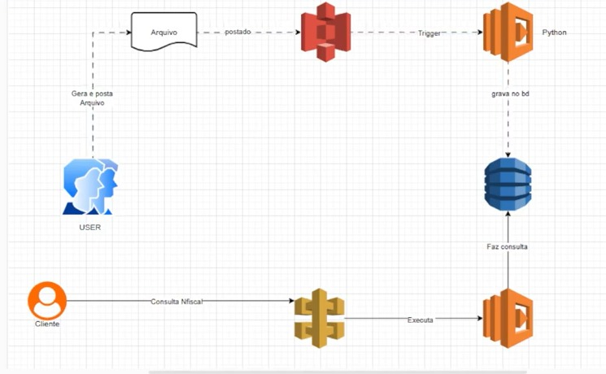

# Arquitetura Serverless para Processamento de Notas Fiscais

## Descrição

Projeto desenvolvido durante o laboratório da DIO com o objetivo de compreender a automação de tarefas utilizando Amazon S3, AWS Lambda e Amazon DynamoDB em uma arquitetura serverless baseada em eventos.

Durante o laboratório foi implementado um fluxo automatizado de processamento de arquivos JSON, demonstrando como integrar serviços da AWS para armazenamento, processamento e consulta de dados.

---

## Objetivos

- Entender o conceito de Serverless;
- Integrar Amazon S3 com AWS Lambda;
- Processar automaticamente arquivos enviados ao S3;
- Armazenar informações no Amazon DynamoDB;
- Disponibilizar consultas através do Amazon API Gateway.

---

## Serviços AWS Utilizados

- AWS Lambda
- Amazon S3
- Amazon DynamoDB
- Amazon API Gateway
- Amazon CloudWatch
- AWS IAM

---

## Arquitetura da Solução




## Objetivo

Este projeto demonstra uma arquitetura serverless na AWS para processar automaticamente arquivos JSON contendo informações de notas fiscais. Após o upload no Amazon S3, uma função AWS Lambda realiza a validação dos dados e os armazena no Amazon DynamoDB. A consulta das informações é realizada por meio do Amazon API Gateway.

## Fluxo da Arquitetura

1. O usuário envia um arquivo JSON para um bucket Amazon S3.
2. O Amazon S3 dispara automaticamente uma função AWS Lambda.
3. A Lambda valida o conteúdo do arquivo.
4. Os dados válidos são gravados no Amazon DynamoDB.
5. O cliente consulta as informações através do Amazon API Gateway, que aciona uma segunda função Lambda para retornar os dados.

## Validações

Durante o processamento são realizadas as seguintes validações:

- Arquivo no formato JSON;
- Campos obrigatórios preenchidos;
- Estrutura do documento válida;
- Dados aptos para gravação no Amazon DynamoDB.

Caso alguma validação falhe, o processamento é interrompido e o erro é registrado no Amazon CloudWatch.

## Considerações

A arquitetura utiliza uma abordagem orientada a eventos, permitindo processamento automático, escalabilidade e baixo custo operacional por utilizar serviços serverless da AWS.

---

## Principais Conceitos

### AWS Lambda

Permite executar código sem gerenciar servidores.

### Amazon S3

Serviço de armazenamento de objetos altamente escalável.

### Amazon DynamoDB

Banco de dados NoSQL utilizado para armazenar os dados processados pela função Lambda.

### Amazon API Gateway

Serviço responsável por disponibilizar uma API REST para consulta das informações armazenadas.

---

## Aprendizados

Durante este laboratório compreendi como utilizar uma arquitetura orientada a eventos para automatizar o processamento de arquivos utilizando Amazon S3 e AWS Lambda.

Também aprendi a armazenar dados em um banco NoSQL com Amazon DynamoDB, disponibilizando consultas por meio do Amazon API Gateway e utilizando o Amazon CloudWatch para monitoramento e registro de logs.

---

## Estrutura do Projeto

```text
.
├── README.md
├── images
│   └── arquitetura.png
└── template.yaml
```

---

## Evidências

As capturas de tela da implementação encontram-se na pasta `images`, demonstrando as principais etapas do laboratório:

- Criação da função AWS Lambda;
- Configuração do bucket Amazon S3;
- Configuração do Trigger do S3;
- Execução da aplicação;
- Registros no Amazon CloudWatch.

---

## Referências

- AWS Lambda: https://docs.aws.amazon.com/lambda/
- Amazon S3: https://docs.aws.amazon.com/s3/
- Amazon DynamoDB: https://docs.aws.amazon.com/dynamodb/
- Amazon API Gateway: https://docs.aws.amazon.com/apigateway/
- Amazon CloudWatch: https://docs.aws.amazon.com/cloudwatch/

---

## Autor

Lucas Alves oi lucas

AWS Certified Cloud Practitioner